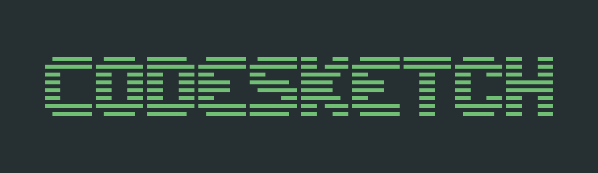

Welcome to CodeSketch. This is a fun interactive game that tests your drawing skills and knowledge of computer science. The objective of the game is to draw a word prompt provided by the game, and have other players guess what you are drawing in a limited amount of time.

## Tips for Playing

- Keep your drawings simple and clear, focusing on key details that will help guessers identify the word.
- Use different colors to add depth and dimension to your drawing. It makes it easier for guessers to distinguish among details.
- Be quick with your guesses, but also pay attention to the details of the drawing.
- Pay attention to the chat box as it might gie you clues on the other players' thinking.
- Remember, it's all about having fun and being creative!

## Tech Stack
Backend:
- NodeJS
- WebSocket (ws)
- Express (needed for future improvements)

Frontend:
- React
- React Router

The front end displays the lobby and game interface. It connects to the backend via the WebSocket protocol. Once enough users (5) have connected to the same game instance, the game is started. The game lifecycle is handled on the backend cycling through the states:
- GAME WAITING
- GAME START
- ROUND START
- ROUND END
- GAME END

The game has a default duration of six rounds, at the end of the last round the game enters into the GAME END state (the game automatically restarts after 60s).